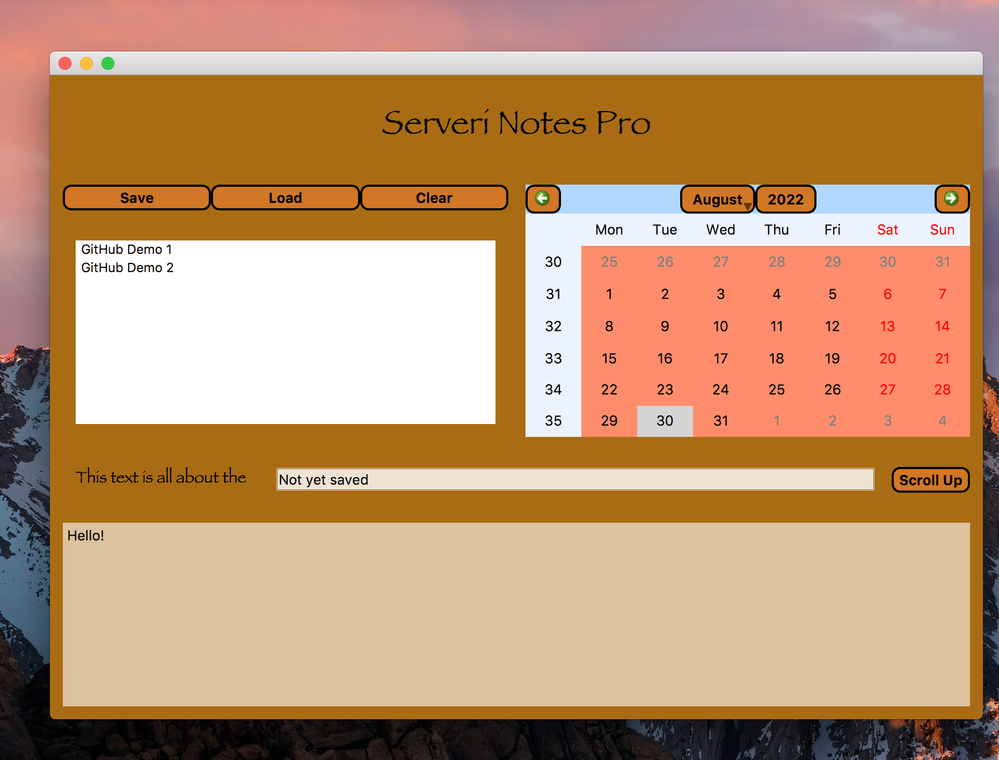
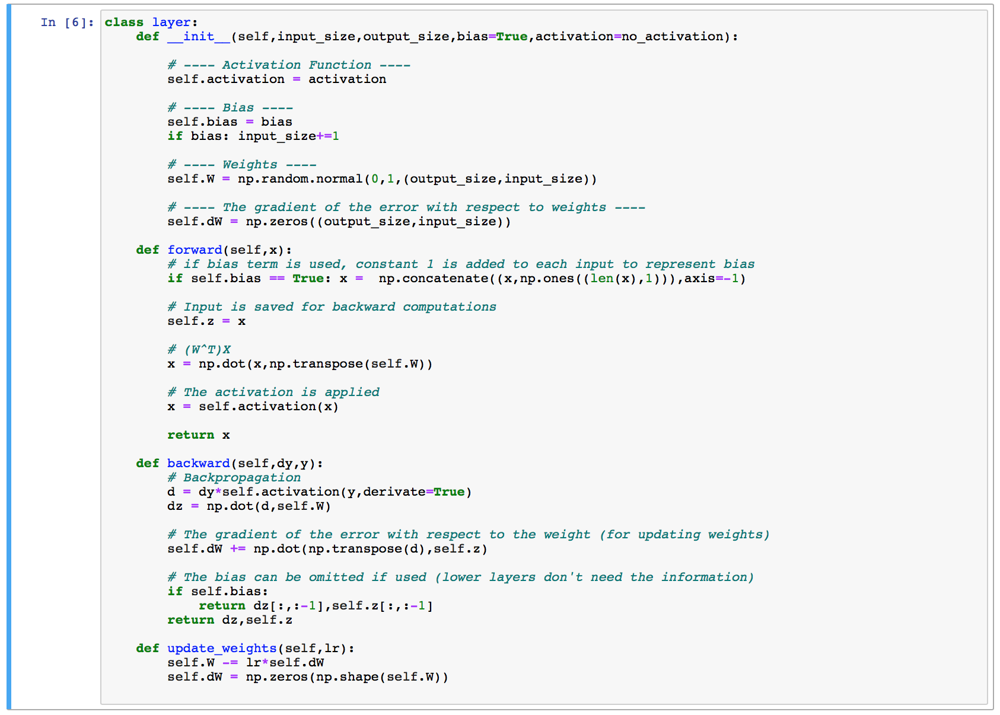
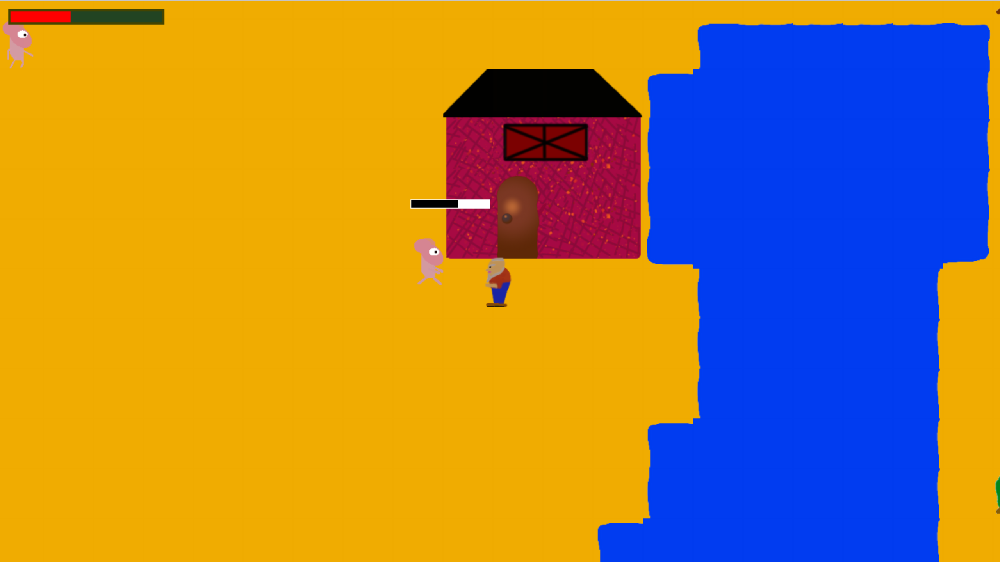

## Hello and welcome to my github page

# Education: 
#### Master of Science || Aalto University
* Masters Programme: Life Science Technologies
* Major: Bioinformatics and Digital Health
* Thesis: Deep Learning Methodologies in Drug Kinase Prediction [(read here)](https://github.com/serveri24h/MyMasterThesis.git)

# Programming Languages: 
* Main: Python
* Others: JS, C, C++, Ruby, Rust, R 

### About me and my GitHub pages

I am recently graduated engineer looking for job as a software or data engineer. 

The main purpose of my GitHub page is to display my coding skills, but all the content (except my thesis) is free to use without any licens. Currently, I have three portfolio projects available and they are listed below.


## Calendar Journal

[go to repository](https://github.com/serveri24h/CalendarJournal.git)

This repository provides a text editor app which allows keeping track of notes using a calendar interface, which has been usefull notekeeping method at least for me. The GUI was programmed using PyQt5 library and database for the notes was implemented using sqlite library.



## Neural Networks from Scratch

[go to repository](https://github.com/serveri24h/NNfrom0.git)

This repository provides a jupyter notebook that demonstrates how neural networks can be implemented using linear algebra and numpy library.



## Simple Top-Down Game

[go to repository](https://github.com/serveri24h/top-down-game.git)

This repository provides a simple top-down game (ref: The Legend of Zelda NES) implemented with PyGame. The game has still some work to do when it comes to level design and graphics, but physics, combat and other logic elements are implented. Feel free to use this repository to design you own top-down adventure game.




<!---
serveri24h/serveri24h is a ✨ special ✨ repository because its `README.md` (this file) appears on your GitHub profile.
You can click the Preview link to take a look at your changes.

bash toimii näin

```bash
pwd
```
--->
