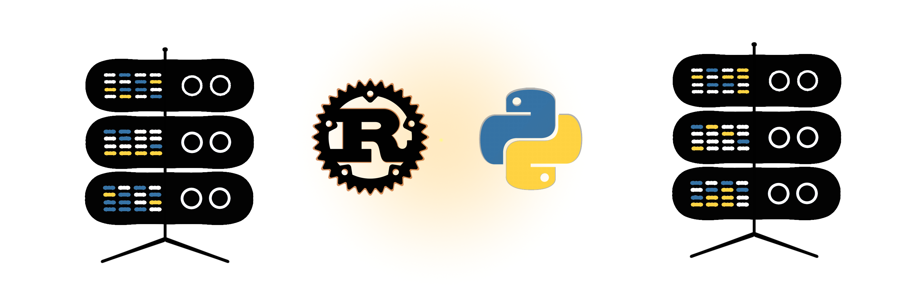

# About me

I am recently graduated engineer looking for oportunities in software or data engineering. 

## Education: 
#### Master of Science || Aalto University || Graduation Date 29.7.2022
* Masters Programme: Life Science Technologies
* Major: Bioinformatics and Digital Health
* Thesis: Deep Learning Methodologies in Drug Kinase Prediction
  * [(Read the thesis here)](http://urn.fi/URN:NBN:fi:aalto-202208285087)
  * [(Repository for replicating the results with a pretrained model)](https://github.com/serveri24h/ThesisResultsReplication)

## Programming Languages: 
* Proficient: **Python**
* Currently Learning: **Rust**     _(...and getting quite comftable with it)_
* Can work with: **JS**, **C**, **R** 
* Have tried: C++, C#, Ruby, PHP, Matlab 

